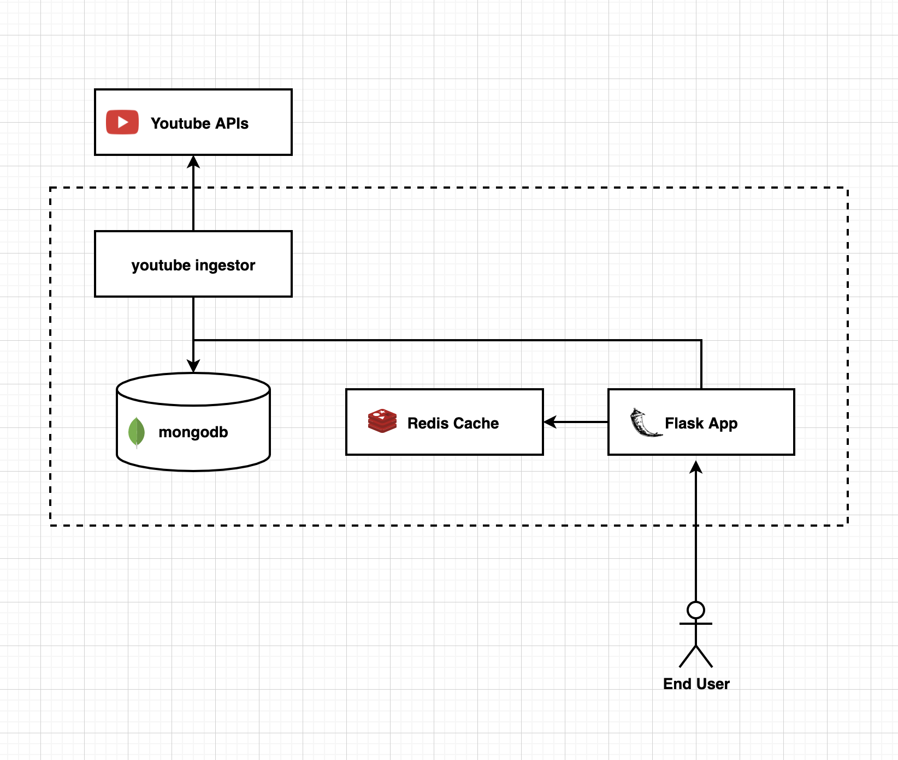

To run locally -  
```
docker-compose up
```


## Architecture



Components
1. Youtube Ingestor - Hits the YouTube API every few minutes in an async cron job and adds details into the DB. It also makes sure the API is hit with `current time - X` minutes.
2. Flask App - The flask app provides the http endpoints to access data. 

    `/video` - GET request that takes 3 query params. `offset`, `page` and `q`, then returns the result based on these inputs when the endpoint is hit. This also gives the path for next page, if list is exhausted null is set for frontend to detect
3. Redis Cache - The flask app uses redis for its cache backend, all incoming request is first looked into the cache before querying the DB. This ensures 
4. Mongodb - data ingestor and flask app use this as the data source. There are 2 indexes - 
    1. Compound-text index on `title` and `description`. Each `q` string is then searched against this in the DB. 
    2. Desc index on `published_at` for reverse chronological order.

